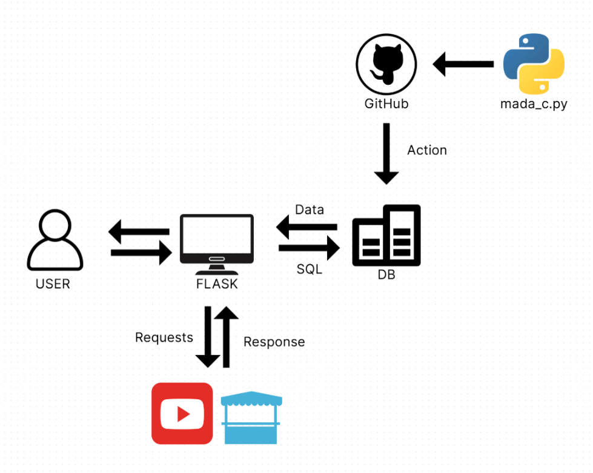
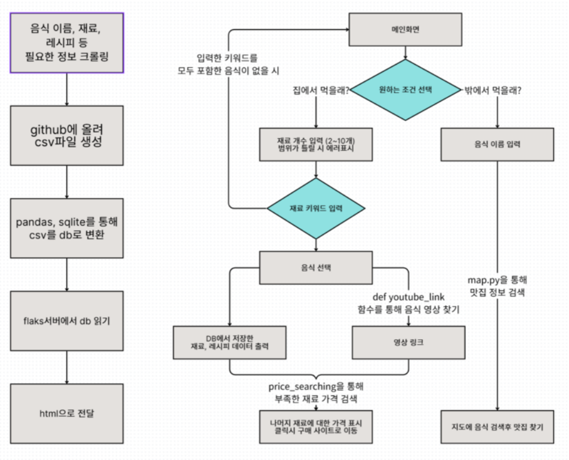

# 🍽️ 재료 맞춤형 레시피 추천 서비스

> "오늘 뭐 먹지?"라는 고민을 해결하기 위해 사용자가 가진 재료를 기반으로 요리를 추천하고, 웹 크롤링을 활용해 맛집 정보까지 제공하는 종합 식사 추천 웹 서비스입니다.

 

### **🎥 데모 영상 (Demo)**

 

## **🎯 프로젝트 목표 및 목적 (Goal)**

일상에서 누구나 겪는 식사 메뉴 선택의 어려움을 해결하고자 했습니다. 냉장고에 있는 재료를 효율적으로 사용하게 하여 식비 절약에 도움을 주고, 때로는 새로운 맛집을 추천하여 즐거운 식사 경험을 제공하는 것을 목표로 합니다.

 

### **✨ 주요 기능 (Features)**
- **맞춤형 요리 추천**: 사용자가 보유한 재료를 2~10개 입력하면, 해당 재료로 만들 수 있는 요리 목록을 DB에서 조회하여 추천합니다.
- **상세 정보 제공**: 추천된 요리의 레시피, 조리 순서, 칼로리 정보와 함께, 실시간으로 크롤링한 유튜브 요리 영상을 제공합니다.
- **재료 구매 연동**: 요리에 부족한 재료가 있을 경우, 온라인 쇼핑몰의 가격 정보 및 구매 링크를 제공하여 편리함을 더했습니다.
- **맛집 추천**: 외식을 선택한 사용자를 위해, 원하는 메뉴를 입력하면 네이버 지도 정보를 실시간으로 크롤링하여 주변 맛집 리스트 링크를 제공합니다.

 

### **🏗️ 아키텍처 및 플로우차트 (Architecture & Flow Chart)**
| System Architecture | Flow Chart |
| :---: | :---: |
|  |  |

 

### **⚙️ 기술 스택 (Tech Stack)**

  
  
  
  
  
   
  
  
  

 

### **🧑‍💻 역할 및 기여 (My Role & Contribution)**
> 이 프로젝트는 4인 팀으로 진행되었으며, 저는 다음과 같은 역할을 담당했습니다.

- **웹 프론트엔드 구조 설계**: 사용자가 서비스를 이용하는 전체 흐름을 고려하여 모든 페이지의 기본 **HTML 구조를 설계하고 완성**했습니다.
- **유튜브 영상 데이터 크롤링**: 사용자 경험 향상을 위해, 추천된 레시피와 관련된 요리 영상을 **Selenium을 이용해 실시간으로 수집**하는 기능을 구현했습니다.
- **서비스 배포 및 발표**: **ngrok**을 활용하여 개발한 웹 서비스를 외부에서 테스트하고 시연할 수 있도록 배포했으며, 프로젝트의 전체 과정과 성과를 정리하여 **최종 발표를 진행**했습니다.

 

### **🤔 문제 해결 (Troubleshooting)**
#### 1. 지도 UI 로딩으로 인한 크롤링 Timeout 에러
- **문제**: 네이버 지도 페이지 크롤링 시, 무거운 지도 타일 UI가 우선적으로 로딩되면서 **Timeout 에러**가 발생했습니다.
- **해결**: 접근 방식을 변경하여, 네이버 통합 검색 결과 페이지에서 '지도 더보기'로 연결되는 **URL 자체를 추출**하는 방식으로 무거운 GUI 렌더링 없이 필요한 정보를 확보했습니다.

#### 2. 크롤링 시 불필요한 데이터 수집 문제
- **문제**: 레시피 목록 크롤링 시, '다음 페이지' 버튼의 텍스트처럼 불필요한 요소까지 함께 수집되었습니다.
- **해결**: `span.link`와 같은 일반적인 선택자 대신, 실제 레시피 링크에만 존재하는 고유 속성을 활용한 `span.link > a[href*="goRecipeView"]`와 같이 **CSS 선택자를 구체화**하여 원하는 데이터만 정확하게 추출했습니다.

 

### **💡 배운 점 (What I Learned)**
- **데이터 처리 능력 향상**: Python을 활용하여 웹상의 비정형 데이터를 수집(Crawling), 정제(Preprocessing), 저장(DB)하는 **데이터 파이프라인의 전 과정을 직접 설계하고 구축**하며 데이터 처리 실무 역량을 키웠습니다.
- **웹 개발 구조 이해**: Flask를 통해 DB의 데이터를 웹페이지와 연동하는 과정을 경험하며 **백엔드 서버의 역할과 데이터 흐름**을 구체적으로 이해하게 되었습니다.
- **협업 및 문제 해결**: 팀원들과의 Git-GitHub 기반 협업을 통해 **소통의 중요성**을 체감했으며, 프로젝트 중 발생한 다양한 문제들을 함께 해결하며 **실질적인 문제 해결 능력**을 기를 수 있었습니다.

 

### **🚀 프로젝트 발표 자료 (Presentation)**
> 전체 발표 내용은 아래 링크에서 PDF 파일로 확인하실 수 있습니다.

**[📄 발표자료 PDF 보기](./docs/python_mini_project_ppt_pdf.pdf)**
